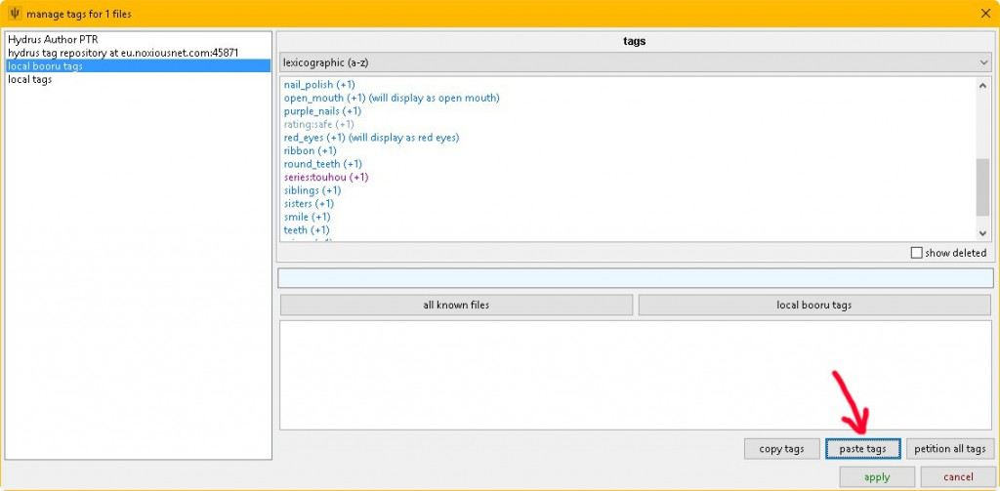

# About

A browser addon I wrote that extracts the tags from booru images and [Illustration2Vec](http://demo.illustration2vec.net) to your clipboard.
It also can download the images along with a .txt file off all the tags with a button press.
Very useful if you like tagging your saved images with things like [Hydrus Network](http://hydrusnetwork.github.io/hydrus).
It’s in its infancy so it might not support every image booru out there but it pull requests for new CSS selectors are welcome.
Feel free to make [GitHub isssues](https://github.com/JetBoom/boorutagparser/issues) with requests for sites that don’t work.

## boorutagparser

  
  
  

This is the browser addon you can install with tampermonkey or greasemonkey. It's written in JavaScript and uses query selectors to search for tags on booru sites. [GitHub here](https://github.com/JetBoom/boorutagparser).

## boorutagparser-server

  
  
  

This is an *optional* program written in Python that runs in the background. The browser addon adds a download button. Pressing it makes this program download images directly along with a tag list directly to your PC with one click. [GitHub here](https://github.com/JetBoom/boorutagparser-server).

# Illustration2Vec

*Note from 2024: I know this is common nowadays but AI tagging an image back in 2016 was a very novel concept.*

This [site](http://demo.illustration2vec.net) is probably the coolest thing I’ve seen in a while. Upload an image and it uses AI to tag it.
It’s surprisingly accurate too, being able to detect minute details and give the image accurate tags. Like the name says, it's intended for illustrations and has trouble with photographs.

# Hydrus Network

If you don’t know what Hydrus Network is, it’s the second coolest thing I’ve seen in a while.
All images can be hashed with sha256, a hash so long that there will likely not be any collisions with any other images.
Hydrus lets you attach tags to those hashes so you can have your own personal collection and very easily sort/search through thousands of images and videos based on those tags.

It can also subscribe to tag servers, a way for people to share the tags they've given to images.
There’s a whole bunch of tag databases and an already-tag-updated installation at the hydrus discussion board.
There’s already millions of image -> tag mappings and it was funny seeing ancient image macros and memes having content tags on them submitted by other people.
