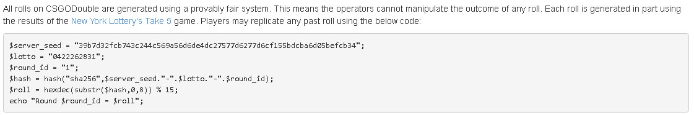
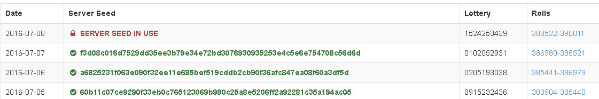
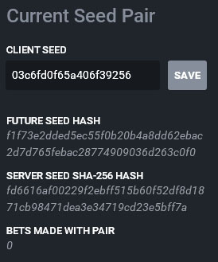
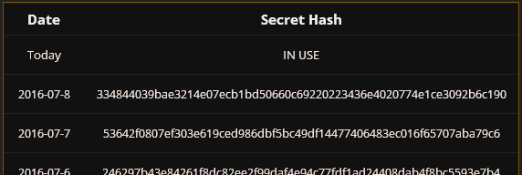

**Disclaimer:** I do not endorse gambling and the site I developed has been shut down for a while.

**tl;dr:** Some gambling sites use provably fair as a cop out and users don’t understand that it doesn’t guarantee a site isn’t rigging or giving out prior knowledge of rolls. Most sites, including the big names, have a provably fair that either allows flat-out rigging or giving out prior knowledge, such as to streamers or friends.

# A New Form of Gambling

In case you didn't know, the video game Counter-Strike: Global Offense (CS\:GO for short) actually has a thriving market of virtual items (called skins), that can have insane real money value. Some skins are worth the same as an actual, real world house. Players of the game can freely trade these items between each other.

Another use that these skins got over recent years was in the gambling space. People realized that they could create a gambling website and skirt the law because these were only skins, not real money you could directly deposit in to your bank account. Bots would handle trading with the players and then dispensing "coins" or some other funny money only available on their site. The players would spin a wheel, lose or gain some coins, then trade those new coins in for some more valuable skins.

I developed one of those sites by myself for a job contract. It was a huge undertaking. One of many things I had to do was to create a system to ultimately determine the winner of rounds, in a close to truly random manner, and have the method provable to not be rigged or predetermined. I decided to make our own from scratch because I found out the phrase “Provably Fair” is just something being thrown around by these sites with no meaning.

For the most part, the results seem fair, but only if none of the contestants have any friends with the administration. I found out that streamers and youtubers have actually [been caught in the past](http://www.esportsbettingreport.com/csgo-diamonds-skin-betting-m0e/ "been caught in the past"), being given prior knowledge of a future result, so they could stream them “winning big”. Then both the site and the celebrity get publicity. Everyone wins, except for the average player. I want to be clear: the CS\:GO Diamonds scandal is only one example of a site that could be giving prior information or flat out changing the results. I am not *accusing* anyone else but I am saying the *possibility* is there.

In this article I’m going to go briefly over what provably fair is, use a couple sites for case studies, and then I’ll go over my personal algorithms at the end. I’ll also go over a few theories/solutions, but they’re mostly just there for entertainment because of how wild they are. There is no simple fix!

# What is Provably Fair?

If you go on these sites and decide to gamble your skins, you’re obviously going to be suspicious, even if it’s a well-known site. One way to garner trust is to have a provably fair system. If you do a quick google search, you’ll understand it more than what I can or should put here. The tl;dr version is that it uses a bunch of complicated math to ensure fair results.

The problem is that, of the many sites I’ve seen, none of them have a system that actually uses something that is provably random. When I say random, I mean that the winning ticket / winning percent / winning roll was determined in a way that it could not be known by the server operators or anyone else. Additionally, it would also need to be in a way that the server operators or anyone else could not flat-out set or rig a match result to what they want.

Provably fair is something you see a lot in crypto coin gambling sites. The reason being because they actually have a third-party source for determining rolls: the block chain. When a person deposits their bitcoins, the site is going to use the transaction data in the rolls. The site does not control that data and it is hard to predict what that data is going to be. It’s perfect for helping determine rolls.

CS\:GO sites that I’ve looked at do not have this. All of their data is determinant and generated by the site. I did not see a single site that used either third-party sources, some form of verifiable entropy, or any other way that could prevent operators from knowing results. Some site algorithms actually allowed flat-out rigging of results or did not have a published algorithm whatsoever!

# Case Studies

When I do these, I will start off by saying which type of site it is: either that the results can be predetermined and given to other people or it is flat-out able to be rigged. I will also list a few sites (definitely not all!) that use the same or a very similar system, go over their algorithm, and at least one method to rig. Again, I only state that they are capable, not that they are guilty of doing so.

## CSGO Wild

Coin flip is both able to be rigged and results given to others before hand. Operators are able to give results of roulette before hand.

#### Similar algorithms

* csgojackpot
* csgolotto
* csgochance
* csgo2x
* csgofast - Winner for roulette is based on a sha224 hash of the winning percent. Can give results before hand and set results before the round starts.
* csgo500 - Needs verification. They obfuscate their client code but from what I could tell from viewing the websockets and prettyprint, it’s similar. They also don’t publish any of their methods despite saying they use a provably fair system in their FAQ. I also found it funny that their Steam group is populated with huge amounts of accounts that have not even set up their community profiles yet – obvious bots or something shady going on there, just go to the later pages of the member list and take a look at the accounts. Also, for some reason all of their group admins have Steamworks badges. Very strange.    many others – Just use google, this is probably the biggest one. The big point is that the winning percent is generated when the round starts and isn’t based on any identifiable source besides whatever internal RNG (or operator choice) the server uses.

You should not say that you are keeping the rounds truly random. There is nothing truly random or even pseudo-random about them, if the operator did not want them to be. This is completely misleading. The round hash is simply there to prove that they are not changing the result of a round after it is created. It does nothing to prevent people knowing the result or setting the result before the person creates the round. Also, since coin flip rounds are not against the house, the house has nothing to lose by letting streamers win big. Of all the provably fairs I’ve seen, this is most likely the weakest one.

#### Potential method(s) of rigging

The winning percent is chosen by the server when the round starts. There is no way to know how the server determines it. The page literally says “the server generates a salt, and a winning percentage to identify the round”. It does not say how it generates it. The salt is just there to prevent rainbow tables reversing the winning percent. The winning percent is not based on some verifiable or determinant source. They have complete control over the result before a round is created. If they wanted a person to win or lose or a color to win or lose, they could simply mark the next X rounds at whatever winning percents they desire.

The winning percent is known by the operators so they could tell people to join or not join certain rooms to guarantee wins.

They could tell others to bet on a certain color in the roulette to win on stream/video.

## CSGO Double

Able to give results before hand.

#### Similar algorithms

* csgostrong - Uses current date as the seed instead of a lotto.
* csgocosmos - Ditto.
* csgocircle - Ditto.
* csgohouse
* csgoroll - Uses a selectable client seed instead of a lotto. This weakens the algorithm further by making it so the operators can tell users what client seed to win with. It would be stronger if it didn’t use a lotto/client seed at all.
* csgoempire

#### Their provably fair




This site uses a pretty simple algorithm. One thing I like about it is that it does show how it determines the winning percent: by taking a part of the resulting hash and converting it to a number. SHA256 is pretty much uniformly random to the casual observer and only tiny bumps in the distribution would occur. Additionally, the use of a daily seed makes it computationally impossible to rig anything beyond the first handful of matches for a day. This makes it leagues above the other sites simply for the fact that it determines the winner in a way you can verify. They do that rather than simply determining the winner, then making it so you can verify they didn’t change the winner. Of course, this system is not perfect. Not perfect at all.

I also want to look at their use of lottery numbers. This is completely useless, extra information. There is really no reason to have it here. Both the server and the client know what it is at all times. It serves no purpose other than to make the algorithm seem more “legit” by having a third party source incorporated. The problem is that the source is 100% transparent. They would achieve the same level of fairness by replacing the lottery numbers of every day with the word “dog”. It’s like having your passwords in a database be salted but telling people what the salt is – totally useless. Not good or bad, but useless.

**Edit:** the owner of Double tells me about their use of lottery numbers. They generate their server seeds based on the previous ones and all seeds have been determined from the moment the site was created. He also tells me that other sites using similar algorithms simply generate a new seed from scratch every day. They use lottery numbers to make it so the server can’t generate strings of “favorable” rounds. So it avoids the operator purposely generating strings of rounds that are the same color, turn up not green, etc. People would be more likely to fall for the gambler’s fallacy and not bet on the same color.

#### Potential method(s) of rigging

The server operators know the results of every round before it happens. They know the round\_id, everyone does. They know the lotto, everyone does. They know the server\_seed, they’re the site operators. That makes it extremely easy for them to give advanced knowledge to other people.

#### Afterthoughts

I came across this video. It’s the same guy from the CSGO Diamonds scandal, winning big and acting super surprised.

[https://www.youtube.com/watch?v=hqIjjGq8vyU](https://www.youtube.com/watch?v=hqIjjGq8vyU)

## CSGO Diamonds

This one is interesting because it has already admitted to rigging with the guy in the previous video. There’s a big fiasco and people are still using it. You can simply google “moe cs godiamonds” to find out more.

#### Their provably fair



```php
// seed: Server Seed from above
// key: Client Seed from above
// nonce: number of bets made with the seed pair
public function roll($seed, $key, $nonce) {
  // Get a sha512 hash from the 3 values
  $hash = hash_hmac('sha512', $key . '-' . $nonce, $seed);
  // Convert first 5 characters of the hash to a numeric roll.
  $roll = hexdec(substr($hash, 0, 5));
  return $roll;
}
```

This one is a bit more complicated than the others. It adds together a server seed, a client seed, and a nonce to generate the winning percent. Additionally, all the seeds it shows you are sha512 hashed to hide what they are until you change them. The client seed is something you pick and the nonce is simply the number of times that you’ve used the seed.

When you change your client seed, the future server seed is set to your current seed. This way it lets you see what you’re going to get before you get it. It also gives you the unhashed version of your previous server seed so you can verify it. This is a really huge complicated mess that all falls apart because of one truth: you don’t know the future+2 seed. You might say, “but wait, if they were rigging wouldn’t they need to make the server seed match up to my client seed?”. Not at all. The reason is simple: because the end result of a round can be the same given different rolls. For example, roulette can still land on the same color if you get 20 or 20.01 as your winning percent.

#### Potential method(s) of rigging

I’ll start off by reminding you: they actually already were caught rigging.

The site operator and a streamer can cooperate. The site operator could make the person get a certain server seed in their “future+1” slot and then tell them which client seed they should pick to win big. No one would be suspicious because the server does not display (or even imply the existence of) a future+1 server seed but nothing says that one can not exist.

## My Algorithms

These are the ones I decided to use. I am not saying they are perfect but I am claiming that they are better. I’m open to peer review from anyone technically inclined.

First, we use a list of daily secrets, extremely similar to what double and a few other sites use. Even bitcoin sites use this system.



The roulette algorithm is also similar to double except for what we use in place of the “lotto”. Instead of using the static lotto numbers, we use the total amount of coins wagered in the round. The reason for this is simple: it’s chaotic. There is no way to tell people to bet on a certain color because at any time, many people are betting, changing their bet amounts, etc all up until the time the wheel starts to spin. The winning percent is determined right as the timer hits 00.00. The detailed results of every round are available for all to see so it would be impossible to change them. csgobig uses a similar system for their roulette and they claim it's 100% fool-proof.

```ts
/** Generate the winning roll, a number from 0 to 100. */
function getWinningPercent(matchId: string, secretHash: string, totalWager: number): number {
	const sha256 = sha('sha256')
	const hash = sha256.update(`${matchId}:${secretHash}:${totalWager}`).digest('hex')
	return parseInt('0x' + hash.substr(-13)) / 0xfffffffffffff * 100
}

/** Gets which color the wheel should land on based on the roll. */
function getResult(winningPercent: number): string {
	winningPercent /= 100

	for (var i=4; i >= 2; i--) {
		if (winning_percent <= WHEEL_COLOR_CHANCES[i])
			return i
	}

	return 1
}
```

Coin flips use a similar system but we also use the participant steamids as extra entropy. The problem right now is that all of this info is (potentially) known by the server, so we’re looking for ways to plug this one up. If one thing is for certain though, I have not seen many 1v1 games on these sites that determine the winner AFTER the person has joined.

```ts
/**
 * Create a coin flip winning percent
 * @param {string} matchId - The public match ID
 * @param {string} secretHash - The daily secret hash that is also public
 * @param {string[]} userIds - Ordered array of the user IDs used in the match
 * @param {number} totalWager - Total number of coins wagered in the match
 * @returns {number} - The winning percentage
*/
function getCoinFlipWinningPercent(matchId: string, secretHash: string, userIds: string[], totalWager: number): number {
  userIds.sort()

  const sha256 = sha('sha256')
  const hash = sha256.update(`${matchId}:${secretHash}:${userIds.join(':')}:${totalWager}`).digest('hex')
  return parseInt('0x' + hash.substr(-13)) / 0xfffffffffffff * 100
}
```

## Theory Crafting

This dilemma has had me thinking for a few days now. Just how can you create a system that is truly provably fair? I’ve had a few thoughts but most of them I’ve disproved already. Most of them are extremely elaborate. Here’s a few that I’ve mulled over:

### Trusted Third Party (players vs. house game)

We’ll replace the lotto again. Let’s consider replacing the lotto with a new value, we’ll call “3rd\_party\_hash”. This setup would require a trusted, third-party site with no affiliation with any other sites, setup for the single purpose of providing gambling sites with hashes.

The gambling site will request, when the round ends and the wheel about to spin, a 3rd\_party\_hash with the round\_id as the input. When the third-party site receives this request, it will respond with the 3rd\_party\_hash but will also enter the round\_id / 3rd\_party\_hash combination in to a public database. If the server requests the same round\_id again, it receives the same hash. The third-party site would generate their hash using some publicly available algorithm, such as using a daily server seed.

#### Pros

* Completely unriggable and completely unable to game results. If the gambling site requested the 3rd\_party\_hash early, the third-party site would have the combination on their public list. This would invalidate all trust with that site. Additionally, if anyone entered a wager after the public list received the request, it would also invalidate all trust.

#### Cons

* Requires absolute trust in the third-party site.
* Requires the third-party site to have 100% up-time.
* Very complicated.

### Rotating Client-side Seed (players vs. house game)

Let’s take for instance, the CSGODouble algorithm from above. Instead of the lotto we’ll use a client seed. The difference here is that the client seed is not stored on the site, but rather in the browser. At the end of the round, the server would request the seed from the player(s) via websockets. If they didn’t respond, it would go to the next candidates.

#### Pros

* Results couldn’t be rigged sometimes.

#### Cons

* Could rig the results sometimes.

### Game not based on luck

Create a game that isn’t based on luck. A player vs. player game where instead of rolling the dice, the players duel in some kind of quick, skillful minigame. The house takes a cut of the winnings so still profits. This would attract a different type of gambler.

#### Pros

* Can’t rig results.
* Unique

#### Cons

* Hard to develop. Need game design skills.
* Have to consider other forms of cheating. Real-time games could have ping discrepancy, botting, aimbots, etc. A strategy game of some sort would be best.
* Taking a risk by creating something new.

# Closing Thoughts

It’s been a really interesting experience making the entire site and using these algorithms. I learned a lot, it was my first attempt at nodejs and it became one of my favorite platforms. Programming the bots, sharpening my CSS, HTML, and JS skills, running a cluster, overcoming the issues of database concurrency in it... it was all a good learn.

Personally I think that most site operators have no malicious intentions and simply incorporate these algorithms without fully understanding what they do. Some must acknowledge that they’re flawed but they simply have no other alternative. The same thing goes for the average user who trusts a site just because “provably fair” is somewhere on the page. Remember: even if a site says it’s provably fair, it does not mean that it is provably honest.
